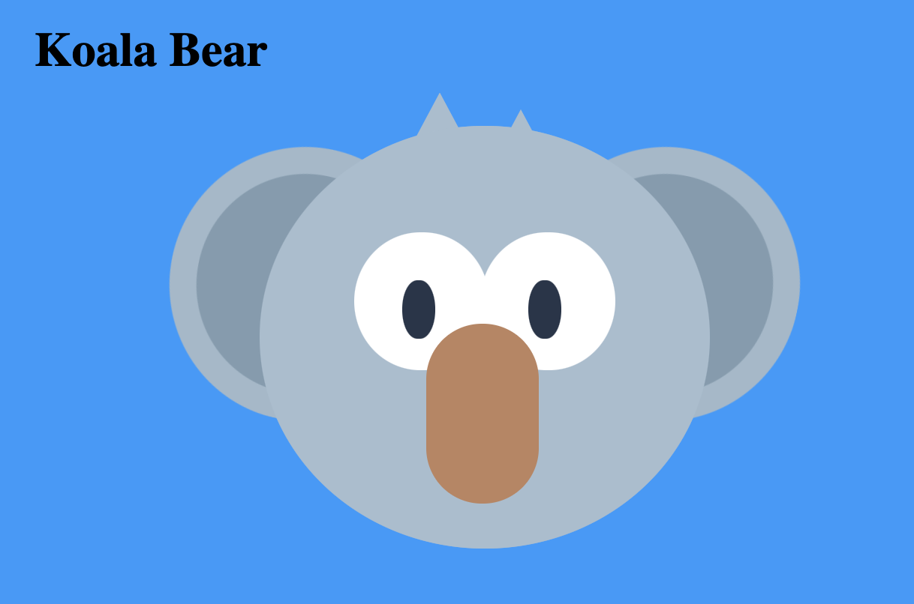
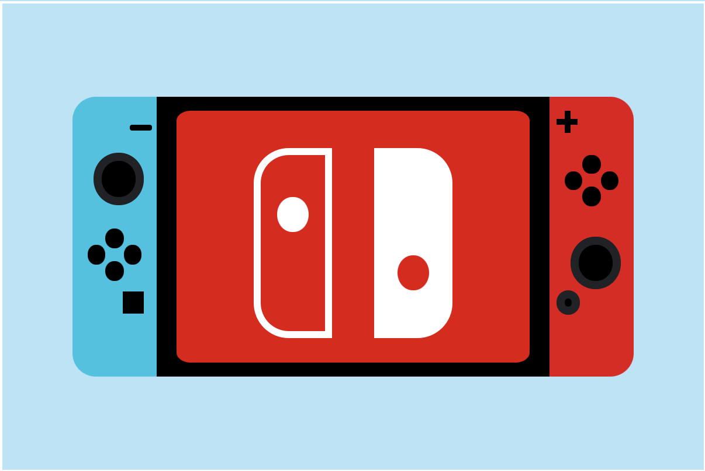

# Pure CSS Images Practice

I'd endeavoured to try and improve my design skills and have started myself on to breaking images down to their smaller shapes, and putting them together to form pure CSS Images. These images will be stored later on my portfolio page, but for now there will be small gifs or images within this readme to show progress.

---

---

---

